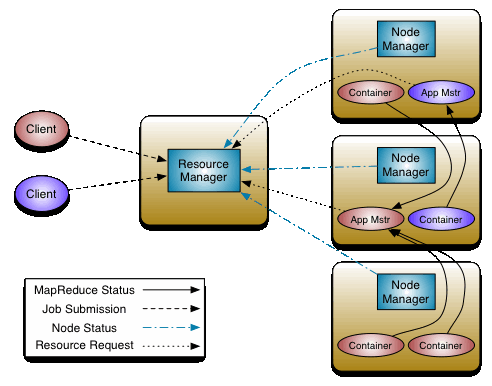

Руководство пользователя по работе с YARN
===========================================

Руководство может быть полезно администраторам, программистам, разработчикам и сотрудникам подразделений информационных технологий, осуществляющих внедрение и эксплуатацию кластера.

.. important:: Контактная информация службы поддержки -- e-mail: info@arenadata.io

Основная идея **YARN** состоит в том, чтобы разделить функции управления ресурсами и планирования/мониторинга заданий на отдельные демоны. Суть заключается в том, чтобы иметь общий ResourceManager и ApplicationMaster для каждого приложения. Приложение -- это отдельная работа или группа работ.

ResourceManager и NodeManager образуют среду для вычисления данных (:numref:`Рис.%s.<yarn_architecture>`). ResourceManager -- это высший орган, который распределяет ресурсы между всеми приложениями в системе. NodeManager -- это агент инфраструктуры для каждой машины, который отвечает за контейнеры, отслеживает использование их ресурсов (процессор, память, диск, сеть) и сообщает об этом в ResourceManager/Scheduler.

ApplicationMaster для каждого приложения, по сути, является библиотекой, специфичной для платформы, и на него возложена задача согласования ресурсов из ResourceManager и работа с NodeManager(-ами) для выполнения и мониторинга задач.

.. _yarn_architecture:

   Архитектура YARN

Получается ResourceManager имеет два основных компонента: Scheduler и ApplicationsManager.

Scheduler отвечает за распределение ресурсов между различными запущенными приложениями с учетом известных ограничений емкости, очередей и т.д. Scheduler является чистым планировщиком в том смысле, что он не выполняет никакого мониторинга или отслеживания состояния приложения. Кроме того, он не дает никаких гарантий относительно перезапуска сбойных задач из-за ошибок приложения или оборудования. Планировщик выполняет свою функцию планирования на основе требований к ресурсам приложений на базе абстрактного понятия *resource Container*, включающего в себя такие элементы, как память, процессор, диск, сеть и т.д.

Планировщик имеет подключаемую политику, которая отвечает за распределение ресурсов кластера между различными очередями, приложениями и т.д. Текущие планировщики, такие как `CapacityScheduler <../administration/yarn/CapacityScheduler>`_ и `FairScheduler <../administration/yarn/FairScheduler>`_, являются некоторыми примерами плагинов.

ApplicationsManager отвечает за прием заявок, согласование первого контейнера для выполнения приложения определенным ApplicationMaster  и предоставляет сервис для перезапуска контейнера ApplicationMaster при сбое. ApplicationMaster для каждого приложения отвечает за согласование подходящих *resource Container* с планировщиком, отслеживание их состояния и мониторинг прогресса.

**MapReduce** в **hadoop-2.x** поддерживает API-совместимость с предыдущей стабильной версией (**hadoop-1.x**). Это означает, что все задания **MapReduce** по-прежнему выполняются поверх **YARN** только с учетом перекомпиляции.

**YARN** поддерживает понятие резервирования ресурсов через ReservationSystem -- компонент, который позволяет пользователям определять профиль ресурсов over-time и задавать временные ограничения (сроки), а так же резервировать ресурсы для обеспечения предсказуемого выполнения важных заданий. ReservationSystem отслеживает ресурсы over-time, выполняет управление допуском для резервирования и динамично инструктирует базовый планировщик, чтобы гарантировать, что резервирование полностью выполнено.

С целью масштабирования **YARN** за пределы нескольких тысяч узлов **YARN** поддерживает понятие Federation через функцию *YARN Federation*. Федерация позволяет прозрачно соединять несколько кластеров (подкластеров) **yarn** и делать их единым массивным кластером. Это может быть использовано для достижения большего масштаба и/или для того, чтобы несколько независимых кластеров могли использоваться вместе для очень объемых заданий.

