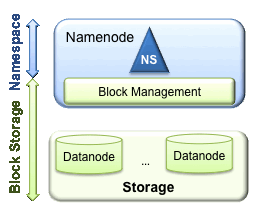
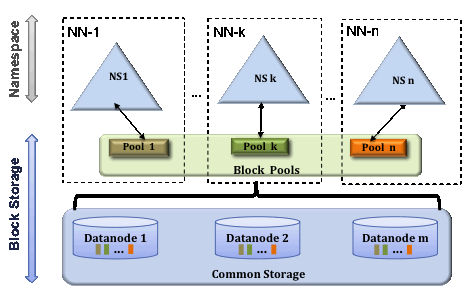

HDFS Federation
================

В главе представлен обзор функционала **HDFS Federation**, а также настройки и управление кластером.

+ `Background`_
+ `Несколько Namenodes/Namespaces`_
+ `Конфигурация`_
+ `Управление`_

Background
-------------

**HDFS** имеет два основных слоя (:numref:`Рис.%s.<background>`):

+ Namespace:

  + Состоит из каталогов, файлов и блоков;
  + Поддерживает все операции с файловой системой, связанные с пространством имен, такие как создание, удаление, изменение и просмотр файлов и каталогов;

+ Block Storage Service:

  + Управление блоком (выполняется в Namenode):
  
    + Обеспечивает членство в кластере Datanode путем обработки регистраций и передачи heartbeats-сообщений;
    + Обрабатывает отчеты о блоках и поддерживает расположение блоков;
    + Поддерживает связанные с блоком операции, такие как создание, удаление, изменение и получение местоположения блока;
    + Управляет размещением реплик, блокирует репликацию для блоков under-replicated и удаляет over-replicated блоки;

  + Хранение -- обеспечивается Datanodes путем хранения блоков в локальной файловой системе и предоставления доступа на чтение/запись.

.. _background:

   Background

Предыдущая архитектура **HDFS** допускает только одно пространство имен для всего кластера и им управляет один Namenode. **HDFS Federation** устраняет это ограничение, добавляя поддержку нескольких Namenodes/Namespaces в **HDFS**.

Несколько Namenodes/Namespaces
--------------------------------

Для горизонтального масштабирования сервиса имен **Federation** использует несколько независимых Namenodes/Namespaces. Узлы Namenodes федеративные, они независимы и не требуют координации друг с другом. Узлы Datanodes используются в качестве общего хранилища для блоков всех Namenodes, и каждая Datanode регистрируется со всеми Namenodes в кластере. Datanodes посылают периодические heartbeats-сообщения и обрабатывают команды из Namenodes (:numref:`Рис.%s.<federation>`).

.. _federation:

   Federation

Пользователи могут использовать ViewFs для создания персонализированных представлений пространства имен. ViewFs аналогичен mount-таблицам на стороне клиента в некоторых системах **Unix**/**Linux**.

**Block Pool** -- это набор блоков, принадлежащих одному пространству имен. Узлы Datanodes хранят блоки для всех пулов в кластере. Каждый пул блоков управляется независимо, что позволяет пространству имен генерировать идентификаторы блоков для новых блоков без необходимости координации с другими пространствами имен. При этом сбой Namenode не препятствует тому, чтобы Datanode обслуживал другие Namenodes в кластере.

Пространство имен и его пул блоков вместе называются **Namespace Volume**. Это самостоятельная единица управления. Когда Namenode/Namespace удаляется, удаляется и соответствующий ему пул блоков в Datanodes. И каждый Namespace Volume обновляется как единое целое во время обновления кластера.

Идентификатор **ClusterID** используется для идентификации всех узлов в кластере. При форматировании Namenode этот идентификатор либо предоставляется, либо генерируется автоматически. 

Ключевые преимущества:

+ Namespace Scalability -- Federation добавляет горизонтальное масштабирование пространства имен. Большие развертывания или развертывания, использующие множество небольших файлов, выигрывают от масштабирования пространства имен, позволяя добавлять больше Namenodes в кластер;

+ Performance -- пропускная способность файловой системы не ограничивается одним Namenode. Добавление дополнительных Namenodes в кластер увеличивает пропускную способность чтения/записи файловой системы;

+ Isolation -- один Namenode не обеспечивает изоляции в многопользовательской среде. Например, экспериментальное приложение может перегрузить Namenode и замедлить работу критически важных приложений. Используя несколько Namenodes, разные категории приложений и пользователей могут быть изолированы в разных пространствах имен.

Конфигурация
--------------

Конфигурация **Federation** обратно совместима и позволяет существующим конфигурациям с одним Namenode работать без каких-либо изменений. Новая конфигурация разработана таким образом, что все узлы в кластере имеют одинаковую конфигурацию, не зависящую от типа узла в кластере.

**Federation** добавляет новую абстракцию **NameServiceID**. Namenode и соответствующие ему вторичные/резервные/контрольные узлы (secondary/backup/checkpointer) -- все принадлежат NameServiceId. Для поддержки одного файла конфигурации к параметрам настроек Namenode и соответствующих ему узлов добавляется суффикс ``NameServiceID``.

1. Добавить параметр ``dfs.nameservices`` в конфигурацию и настроить его с разделенным запятыми списком NameServiceID. Параметр используется Datanodes для определения Namenodes в кластере.

2. Для каждого Namenode и Secondary Namenode/BackupNode/Checkpointer добавить следующие параметры конфигурации с суффиксом соответствующего NameServiceID в общий файл конфигурации:

+ Namenode:

  + *dfs.namenode.rpc-address* 
  + *dfs.namenode.servicerpc-address*
  + *dfs.namenode.http-address*
  + *dfs.namenode.https-address*
  + *dfs.namenode.keytab.file*
  + *dfs.namenode.name.dir*
  + *dfs.namenode.edits.dir*
  + *dfs.namenode.checkpoint.dir*
  + *dfs.namenode.checkpoint.edits.dir*

+ Secondary Namenode:

  + *dfs.namenode.secondary.http-address* 
  + *dfs.secondary.namenode.keytab.file*

+ BackupNode:

  + *dfs.namenode.backup.address*
  + *dfs.secondary.namenode.keytab.file*

Пример конфигурации с двумя Namenodes:

::

 <configuration>
   <property>
     <name>dfs.nameservices</name>
     <value>ns1,ns2</value>
   </property>
   <property>
     <name>dfs.namenode.rpc-address.ns1</name>
     <value>nn-host1:rpc-port</value>
   </property>
   <property>
     <name>dfs.namenode.http-address.ns1</name>
     <value>nn-host1:http-port</value>
   </property>
   <property>
     <name>dfs.namenode.secondary.http-address.ns1</name>
     <value>snn-host1:http-port</value>
   </property>
   <property>
     <name>dfs.namenode.rpc-address.ns2</name>
     <value>nn-host2:rpc-port</value>
   </property>
   <property>
     <name>dfs.namenode.http-address.ns2</name>
     <value>nn-host2:http-port</value>
   </property>
   <property>
     <name>dfs.namenode.secondary.http-address.ns2</name>
     <value>snn-host2:http-port</value>
   </property>
 
   .... Other common configuration ...
 </configuration>

Форматирование Namenodes осуществляется в два шага:

1. Отформатировать Namenode, используя команду:

::

 [hdfs]$ $HADOOP_HOME/bin/hdfs namenode -format [-clusterId <cluster_id>]
 
Необходимо выбрать уникальный ``cluster_id``, который не будет конфликтовать с другими кластерами в среде. Если параметр не указан, то он генерируется автоматически.

2. Отформатировать дополнительные Namenodes, используя команду:

::

 [hdfs]$ $HADOOP_HOME/bin/hdfs namenode -format -clusterId <cluster_id>
 
Важно обратить внимание, что ``cluster_id`` на этом шаге должен быть таким же, как в предыдущем. Если они отличаются, дополнительные Namenodes не будут частью кластера Federation.

В процессе обновления с предыдущего релиза и настройки **Federation** необходимо указать ClusterID следующим образом:

::

 [hdfs]$ $HADOOP_HOME/bin/hdfs --daemon start namenode -upgrade -clusterId <cluster_ID>

Если ``cluster_id`` не указан, он генерируется автоматически.

Добавление нового Namenode в существующий кластер **HDFS** осуществляется в результате следующих действий:

+ Добавить ``dfs.nameservices`` в конфигурацию;
+ Обновить конфигурацию с помощью суффикса ``NameServiceID``, чтобы использовать Federation;
+ Добавить новую конфигурацию, связанную с Namenode, в файл конфигурации;
+ Распространить файл конфигурации на все узлы в кластере;
+ Запустить новый Namenode и Secondary/Backup;
+ Обновить Datanodes, чтобы получить только что добавленный Namenode, выполнив следующую команду для всех Datanodes в кластере:

::

 [hdfs]$ $HADOOP_HOME/bin/hdfs dfsadmin -refreshNamenodes <datanode_host_name>:<datanode_rpc_port>

Управление
-------------

Команда для запуска кластера:

::

 [hdfs]$ $HADOOP_HOME/sbin/start-dfs.sh

Команда для остановки кластера:

::

 [hdfs]$ $HADOOP_HOME/sbin/stop-dfs.sh

Команды можно запускать с любого узла, где доступна конфигурация **HDFS**. Команда использует конфигурацию для определения Namenodes в кластере, а затем запускает процесс Namenode на этих узлах. Datanodes запускаются на узлах, указанных в файле *workers*. Скрипт можно использовать в качестве ссылки для создания собственных сценариев запуска и остановки кластера.

Balancer
^^^^^^^^^^

Для работы с несколькими Namenodes изменен Balancer:

::

 [hdfs]$ $HADOOP_HOME/bin/hdfs --daemon start balancer [-policy <policy>]

Параметр политики может быть любым из следующих:

+ ``datanode`` -- политика по умолчанию, уравновешивает хранение на уровне Datanode. Политика похожа на политику балансировки из предыдущих выпусков;
+ ``blockpool`` -- политика балансирует хранилище на уровне пула блоков, который в свою очередь балансируется на уровне Datanode.

.. important:: Balancer балансирует только данные и не балансирует пространство имен

Decommissioning
^^^^^^^^^^^^^^^^^

Вывод из эксплуатации аналогичен предыдущим релизам -- узлы, которые должны быть выведены из эксплуатации, добавляются в файл *exclude* на всех Namenodes. Каждый Namenode выводит из строя свой Block Pool. Когда все Namenodes завершают вывод из эксплуатации Datanode, узел Datanode считается списанным:

1. Команда для распространения файла *exclude* на все Namenodes:

::

 [hdfs]$ $HADOOP_HOME/sbin/distribute-exclude.sh <exclude_file>

2. Обновление всех Namenodes для получения нового файла *exclude*:

::

 [hdfs]$ $HADOOP_HOME/sbin/refresh-namenodes.sh

Команда использует конфигурацию **HDFS** для определения настроенных Namenodes в кластере и обновляет их, чтобы получить новый файл *exclude*.

Cluster Web Console
^^^^^^^^^^^^^^^^^^^^

Подобно веб-странице статуса Namenode, при использовании **Federation** веб-консоль кластера доступна для мониторинга по адресу *http://<any_nn_host:port>/dfsclusterhealth.jsp*. Любой Namenode в кластере может быть использован для доступа к этой веб-странице.

Веб-консоль кластера предоставляет следующую информацию:

+ Сводная информация о кластере, которая показывает количество файлов, количество блоков, общую настроенную емкость хранилища, а также доступное и используемое хранилище для всего кластера;
+ Список Namenodes и сводку, которая включает в себя количество файлов, блоков, отсутствующих блоков и узлов живых и мертвых данных для каждого Namenode. Также предоставляется ссылка для доступа к веб-интерфейсу каждого Namenode;
+ Статус декомиссии Datanodes.

