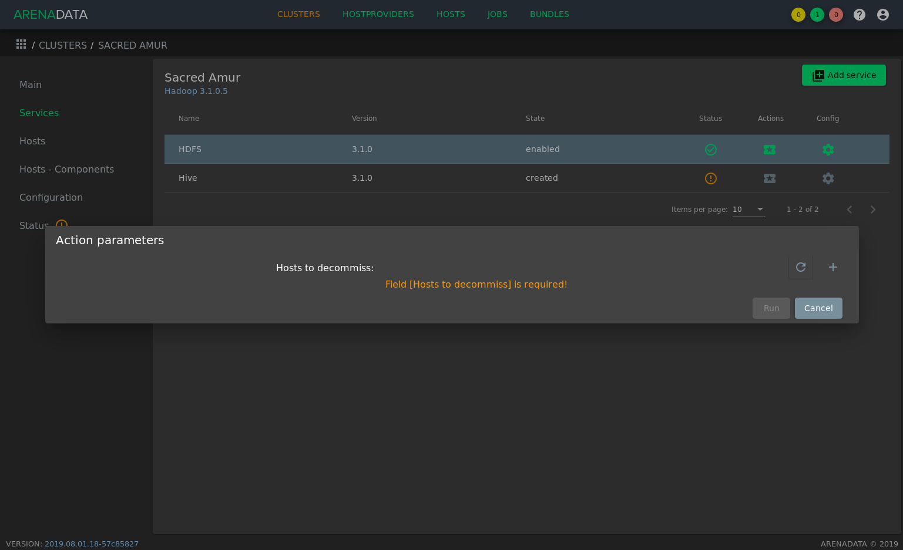

Добавление/удаление и обслуживание/декоммиссия HDFS DataNode
============================================================

Для добавления или удаления HDFS DataNode с хостов или привидения HDFS DataNode в состояние обслуживания или декоммисии на хосте необходимо воспользоваться соответствующими кнопками выпадающего меню, доступного по нажатию на иконку в поле *"Actions"* сервиса HDFS:

.. figure:: ../../imgs/administration/hdfs/buttons.png
   :align: center

   Выпадающее меню *"Actions"* сервиса HDFS

Эти кнопки являются простым интерфейсом для управления состояниями DataNode, более подробно описанной в документации `Apache Hadoop <https://hadoop.apache.org/docs/r3.1.0/hadoop-project-dist/hadoop-hdfs/HdfsDataNodeAdminGuide.html>`_.

.. important:: Описанные ниже операции не удаляют/добавляют хост из кластера -- они лишь управляют компонентом HDFS DataNode на хостах. Удаление хоста из кластера возможно в разделе *"Hosts"* кластера в случаях, когда к хосту не привязан ни один компонент. Добавление хоста производится согласно :ref:`инструкции <add_hosts>`.

Добавление HDFS DataNode
^^^^^^^^^^^^^^^^^^^^^^^^

Для добавления одной или нескольких дополнительных HDFS DataNode на хосты кластера необходимо:

1. нажать кнопку *"Add DataNodes"*, что приведёт к появлению окна, аналогичному разделу *"Hosts - Components"* кластера, описанному в разделе :ref:`install_components`;

2. любым из двух способов назначить добавляемому компоненту хост (компонент HDFS DataNode будет выделен белым как возможный к расширению):

   - выбрать компонент в колонке "Components" и назначить для него хост в колонке "Hosts";
   - выбрать хост в колонке "Hosts" и определить для него компонент в колонке "Components".

3. нажать кнопку *"Run"* в нижней части окна.

Обслуживание HDFS DataNode
^^^^^^^^^^^^^^^^^^^^^^^^^^

В случае необходимости вывести хост из работы на короткий промежуток времени его возможно перевести в режим обслуживания.

В этом режиме HDFS не будет относить блоки DataNode как необходимые для репликации (under-replicated blocks), что также может быть полезно и в других ситуациях кроме недолгосрочного обслуживания.

Для переведения одной или нескольких HDFS DataNode в режим обслуживания необходимо:

1. нажать кнопку *"Maintenance DataNodes"*, что приведёт к появлению следующего окна:

.. figure:: ../../imgs/administration/hdfs/maintenance.png
   :align: center

2. для добавления хоста в список на обслуживание необходимо нажать "+" и ввести fqdn хоста и время окончания окна обслуживания в формате `UNIX-времени <https://ru.wikipedia.org/wiki/Unix-%D0%B2%D1%80%D0%B5%D0%BC%D1%8F>`_ в миллисекундах. Через "+" возможно добавить несколько хостов.

3. нажать кнопку *"Run"* в нижней части окна.

Декоммиссия HDFS DataNode
^^^^^^^^^^^^^^^^^^^^^^^^^

В случае необходимости вывести хост из работы на длительный промежуток времени или удалить из кластера его сначала необходимо декоммиссовать.

В этом режиме HDFS будет относить блоки DataNode как необходимые для репликации (under-replicated blocks).

Для декоммиссии одной или нескольких HDFS DataNode:

1. нажать кнопку *"Decommiss DataNodes"*, что приведёт к появлению следующего окна:

2. для добавления хоста в список декоммиссованных необходимо нажать "+" и ввести fqdn хоста. Через "+" возможно добавить несколько хостов.

3. нажать кнопку *"Run"* в нижней части окна.

Рекоммиссия HDFS DataNode
^^^^^^^^^^^^^^^^^^^^^^^^^

Для рекоммиссии (выведения хоста из состояния обслуживания или декоммиссии) одной или нескольких HDFS DataNode:

1. нажать кнопку *"Recommiss DataNodes"*, что приведёт к появлению всплывающего окна, аналогичному окну декоммиссии.

2. для добавления хоста в список рекоммиссованных необходимо нажать "+" и ввести fqdn хоста. Через "+" возможно добавить несколько хостов.

3. нажать кнопку *"Run"* в нижней части окна.

Удаление HDFS DataNode
^^^^^^^^^^^^^^^^^^^^^^

Для удаления одной или нескольких HDFS DataNode с хостов кластера необходимо:

1. нажать кнопку *"Remove DataNodes"*, что приведёт к появлению окна, аналогичному разделу *"Hosts - Components"* кластера, описанному в разделе :ref:`install_components`;

2. любым из двух способов удалить привязку компонента к хосту (компонент HDFS DataNode будет выделен белым как возможный к удалению с хостов):

   - выбрать компонент в колонке "Components" и убрать выделение с хостов в колонке "Hosts", рамки которых выделены зелёным;
   - выбрать хост в колонке "Hosts" и убрать выделение с компонента HDFS DataNode в колонке "Components" если рамка компонета HDFS DataNode выделяется зелёным.

3. нажать кнопку *"Run"* в нижней части окна.
