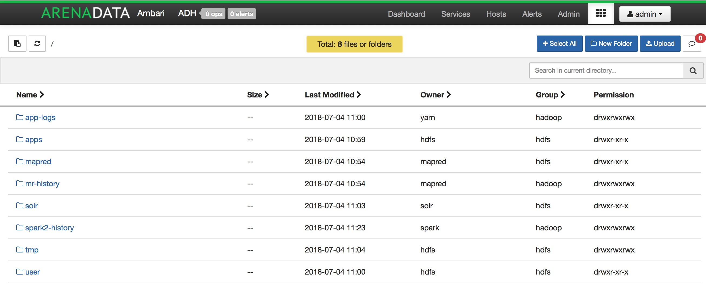
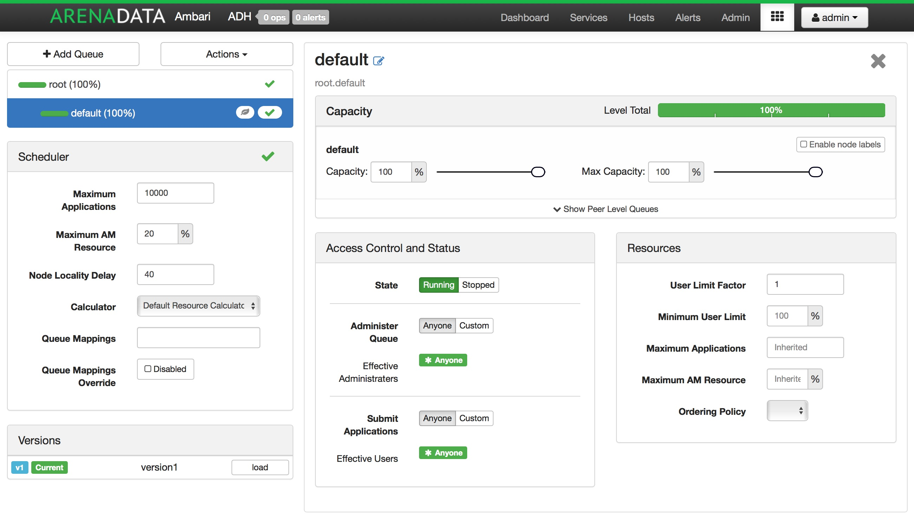
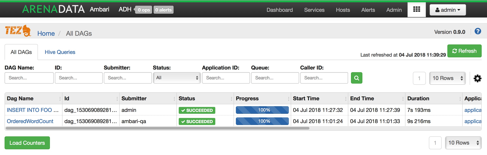
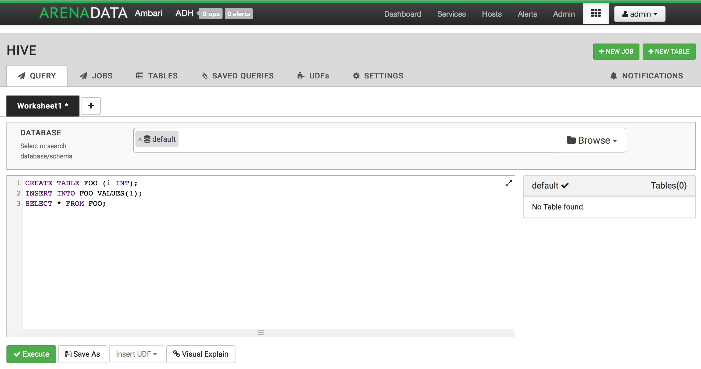
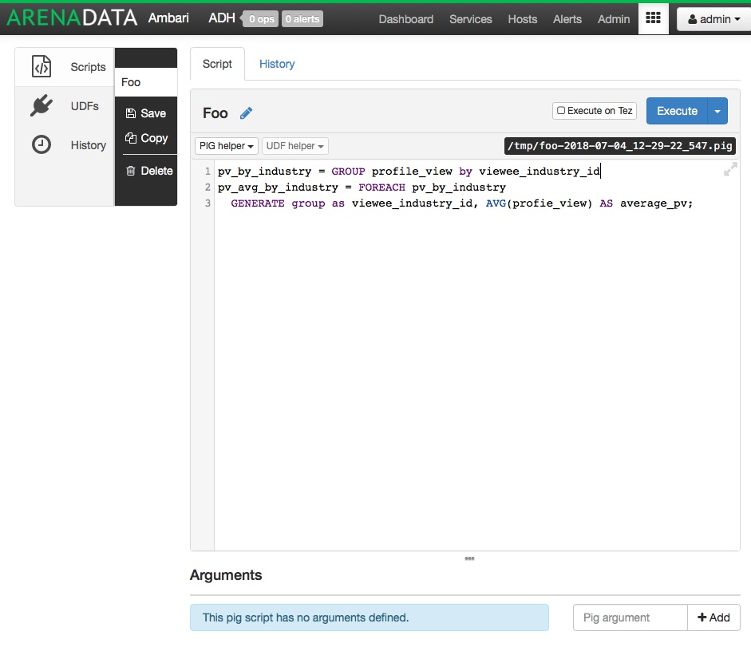

Использование Ambari View
==========================

**Arenadata Ambari** предоставляет возможность использования представления (View) для работы с различными сервисами стека **Hadoop**.

**Ambari Views** -- это способ расширения **Ambari**, который позволяет третьим сторонам подключать новые интерфейсы работы и управления сервисами.

Files View
----------

**Files View** позволяет пользователю управлять, просматривать и загружать файлы и папки в **HDFS** (:numref:`Рис.%s.<view_files>`).

.. _view_files:

   Пример экрана Files View

Настройка Kerberos для Files View
^^^^^^^^^^^^^^^^^^^^^^^^^^^^^^^^^^

Перед настройкой **Kerberos** для **Files View** необходимо сначала сконфигурировать **Kerberos** для **Ambari**, настроив для демона **Ambari Server** принципал **Kerberos** и таблицу ключей.

После настройки **Kerberos** для **Ambari** в разделе "Settings" настраиваемого View необходимо ввести свойства, описанные в таблице:

.. csv-table::
   :header: "Параметр", "Описание", "Значение"
   :widths: 33, 33, 33

    "WebHDFS Username", "Имя пользователя, под которым View будет обращаться к HDFS", "``${username}``"
    "WebHDFS Authorization", "Строка аутентификации для доступа к WebHDFS", "``auth=KERBEROS;proxyuser=ambari-server``"

При конфигурации **Kerberos** настройка прокси-пользователя должна быть основным значением принципала **Kerberos** для **Ambari Server**. Например, при настройке сервера **Ambari** для приницпала ``ambari-server@EXAMPLE.COM`` значение -- ``ambari-server``.

Capacity Scheduler View
-----------------------

**Capacity Scheduler** помогает оператору **Hadoop** легко настраивать управление рабочей нагрузкой **YARN** для обеспечения многопользовательской и сильно нагруженной обработки.

В **Capacity Scheduler** представлены ресурсы кластера для создания и управления очередями **YARN** (:numref:`Рис.%s.<view_capacity>`).

.. _view_capacity:

   Пример экрана Capacity View

Tez View
--------

**Tez View** предоставляет интерфейс мониторинга здадач **Tez**. Используя **Tez View**, можно оптимизировать и ускорить отдельные SQL-запросы или задачи **Pig** с целью получения максимальной производительности в многопользовательской среде **Hadoop** (:numref:`Рис.%s.<view_tez>`).

.. _view_tez:

   Пример экрана Tez View

Hive View
---------

**Hive View** позволяет пользователю писать и выполнять SQL-запросы в кластере. Показывает историю всех запросов **Hive**, выполняемых на кластере, независимо от того, выполняются ли они из представления **Hive** или из другого источника, такого как **JDBC**/**ODBC** или **CLI**.

**Hive View** также дает графическое представление плана выполнения запроса. Это помогает пользователю отлаживать запрос для корректной настройки производительности.

Представление интегрируется с **Tez View**, позволяет пользователю отлаживать любую задачу **Tez**, в том числе отслеживать ход выполнения задачи (будь то **Hive** или **Pig**) во время работы (:numref:`Рис.%s.<view_hive>`).

.. _view_hive:

   Пример экрана Hive View

Настройка HDFS для Hive View
^^^^^^^^^^^^^^^^^^^^^^^^^^^^

**Hive View** хранит метаданные пользователя в **HDFS** и по умолчанию используется ``/user/${username}``, где ``${username}`` -- это имя пользователя, вошедшего в данный момент в систему и получающего доступ к представлению **Hive**. Для корректной работы **Hive View** необходимо настроить домашний каталог пользователя в **HDFS**.

.. important:: Поскольку многие пользователи используют по умолчанию администратора Ambari для начала работы с кластером необходимо создать папку ``/user/admin`` в HDFS прежде, чем использовать представление Hive

Для того, чтобы создать пользовательские каталоги в **HDFS** для каждого пользователя **Hive View** необходимо:

+ Подключиться к хосту в кластере, который включает в себя клиент HDFS;

+ Переключиться на пользователя системной учетной записи hdfs:

  ::
   
   su - hdfs

+ Используя клиент HDFS, создать каталог HDFS для пользователя. Например, если имя пользователя *admin*, создать каталог следующим образом:

   ::
   
    hadoop fs -mkdir /user/admin

+ Установить права на вновь созданный каталог. Например, если имя пользователя *admin*, сделать данного пользователя владельцем каталога:

   ::
   
    hadoop fs -chown admin:hadoop /user/admin

Настройка SSL для Hive View
^^^^^^^^^^^^^^^^^^^^^^^^^^^^

Перед настройкой SSL-протокола для **Hive View** необходимо сначала настроить Truststore для **Ambari Server**, импортировав все необходимые ключи в Truststore.

После настройки SSL для **Ambari** в разделе "Settings" настраиваемого View необходимо ввести свойство:

+ *Hive Session Parameters* -- дополнительные параметры, передаваемые в рамках сессии Hive:

  ::
  
   sslTrustStore=/path_to_ambari_truststore/ambari_truststore_name.jks;trustStorePassword=********
   

Pig View
--------

**Pig View** аналогичен **Hive View**. Позволяет писать и запускать скрипт **Pig**. Поддерживает сохранение скриптов, а также загрузку и использование существующих **UDF** в скриптах (:numref:`Рис.%s.<view_pig>`).

.. _view_pig:

   Пример экрана Pig View

.. important:: Помимо приведенных пользовательских представлений существует растущая экосистема Ambari User Views, разрабатываемая сообществом
