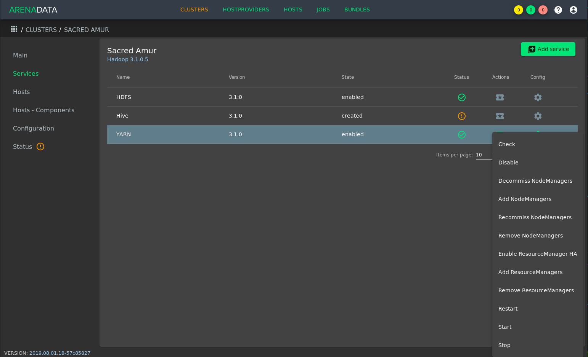

Добавление/удаление и декоммиссия YARN NodeManager
==================================================

Для добавления или удаления YARN NodeManager с хостов или привидения YARN NodeManager в состояние декоммисии на хосте необходимо воспользоваться соответствующими кнопками выпадающего меню, доступного по нажатию на иконку в поле *"Actions"* сервиса YARN:

   Выпадающее меню *"Actions"* сервиса YARN

Эти кнопки являются простым интерфейсом для управления состояниями NodeManager, более подробно описанной в документации `Apache Hadoop <https://hadoop.apache.org/docs/r3.1.0/hadoop-yarn/hadoop-yarn-site/GracefulDecommission.html>`_.

.. important:: Описанные ниже операции не удаляют/добавляют хост из кластера -- они лишь управляют компонентом YARN NodeManager на хостах. Удаление хоста из кластера возможно в разделе *"Hosts"* кластера в случаях, когда к хосту не привязан ни один компонент. Добавление хоста производится согласно :ref:`инструкции <add_hosts>`.

Добавление YARN NodeManager
^^^^^^^^^^^^^^^^^^^^^^^^^^^

Для добавления одной или нескольких дополнительных YARN NodeManager на хосты кластера необходимо:

1. нажать кнопку *"Add NodeManagers"*, что приведёт к появлению окна, аналогичному разделу *"Hosts - Components"* кластера, описанному в разделе :ref:`install_components`;

2. любым из двух способов назначить добавляемому компоненту хост (компонент YARN NodeManager будет выделен белым как возможный к расширению):

   - выбрать компонент в колонке "Components" и назначить для него хост в колонке "Hosts";
   - выбрать хост в колонке "Hosts" и определить для него компонент в колонке "Components".

3. нажать кнопку *"Run"* в нижней части окна.

Декоммиссия YARN NodeManager
^^^^^^^^^^^^^^^^^^^^^^^^^^^^

В случае необходимости вывести хост из работы или удалить из кластера его сначала необходимо декоммиссовать.

Есть два типа декоммиссии:

  - нормальный -- в этом режиме нода YARN NodeManager прекращает работу безусловно, не ожидая завершения работающих на ноде контейнеров.
  - изящный (graceful) -- в этом режиме планировщик YARN не будет назначать новые контейнеры декоммиссованной ноде YARN NodeManager, а работающие контейнеры продолжат работу до истечения назначенного таймаута.

Для декоммиссии одной или нескольких YARN NodeManager:

1. нажать кнопку *"Decommiss NodeManagers"*, что приведёт к появлению следующего окна:

.. figure:: ../../imgs/administration/yarn/decommission.png
   :align: center

2. для добавления хоста в список декоммиссованных необходимо нажать "+" и ввести fqdn хоста и таймаут в секундах. Через "+" возможно добавить несколько хостов.

3. нажать кнопку *"Run"* в нижней части окна.

Рекоммиссия YARN NodeManager
^^^^^^^^^^^^^^^^^^^^^^^^^^^^

Для рекоммиссии (выведения хоста из состояния декоммиссии) одной или нескольких YARN NodeManager:

1. нажать кнопку *"Recommiss NodeManagers"*, что приведёт к появлению всплывающего окна, аналогичному окну декоммиссии.

2. для добавления хоста в список рекоммиссованных необходимо нажать "+" и ввести fqdn хоста. Через "+" возможно добавить несколько хостов.

3. нажать кнопку *"Run"* в нижней части окна.

Удаление YARN NodeManager
^^^^^^^^^^^^^^^^^^^^^^^^^

Для удаления одной или нескольких YARN NodeManager с хостов кластера необходимо:

1. нажать кнопку *"Remove NodeManagers"*, что приведёт к появлению окна, аналогичному разделу *"Hosts - Components"* кластера, описанному в разделе :ref:`install_components`;

2. любым из двух способов удалить привязку компонента к хосту (компонент YARN NodeManager будет выделен белым как возможный к удалению с хостов):

   - выбрать компонент в колонке "Components" и убрать выделение с хостов в колонке "Hosts", рамки которых выделены зелёным;
   - выбрать хост в колонке "Hosts" и убрать выделение с компонента YARN NodeManager в колонке "Components" если рамка компонета YARN NodeManager выделяется зелёным.

3. нажать кнопку *"Run"* в нижней части окна.
