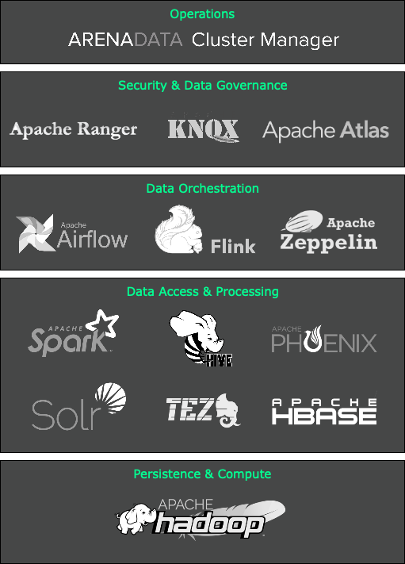
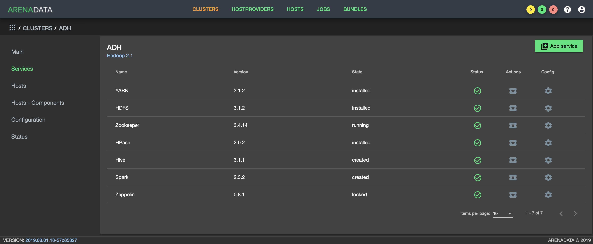

.. _ADH_index_logo:

Дистрибутив Arenadata Hadoop
==============================

**Arenadata Hadoop** (**ADH**) -- это интегрированный набор компонентов корпоративного уровня на базе решений с открытым исходным кодом. Платформа включает в себя все необходимые компоненты для работы с данными: управление, доступ, анализ, интеграция, безопасность и администрирование.

Основная идея дистрибутива заключается в обеспечении возможности работы с любыми типами и форматами данных путем комбинированного использования различных технологических решений и архитектур обработки данных.

В настоящий момент все компоненты платформы оркестрируются через единую систему управления `Arenadata Cluster Manager <https://docs.arenadata.io/adcm/>`_.

В 2016 году дистрибутив **Arenadata Hadoop 1.3.2** прошел сертификацию и получил подтверждение о полном соответствии стандартам **Open Data Platform Initiative** (**ODPi**). **ODPi** – крупнейшее мировое сообщество разработчиков проектов хранения больших данных с открытым кодом под эгидой **Linux Foundation**: `подробнее <https://www.odpi.org/blog/2016/07/13/hadoop-summit-san-jose-2016-wrap-up>`_.

Текущий релиз версии **2.1.0** был выпущен в третьем квартале 2019 года. В состав версии входят следующие компоненты: **HDFS**, **YARN**,	**Zookeeper**, **Tez**, **Hive**,	**HBase**, **Phoenix**, **Spark**, **Zeppelin**.

В отличие от других корпоративных дистрибутивов, представленных на рынке, **Arenadata Hadoop** обладает рядом особенностей:

+ Вся поддержка и непосредственно экспертиза доступна в России и на русском языке;
+ Есть пакет утилит для полной off-line установки (без доступа к сети Интернет);
+ Вся сборка выполнена на базе открытых проектов Apache, нет проприетарных компонентов;
+ Российское программное обеспечение;
+ Поддержка доступна как удаленно, так и on-site;
+ Есть набор доступных типовых пакетных сервисов по планированию, установке и аудиту системы.

**Arenadata Hadoop** обеспечивает полный набор возможностей и инструментов для автоматического развертывания компонентов как на "голом железе", так и на виртуальных машинах (в "облаке"). Средства мониторинга и управления конфигурацией кластера позволяют оптимизировать производительность для всех компонентов системы.

Оригинальная документация на русском языке позволяет облегчить процесс планирования и разворачивания кластера **Hadoop**. Инструкция может быть полезна администраторам, программистам, разработчикам и сотрудникам подразделений информационных технологий, осуществляющих внедрение и сопровождение кластеров **Arenadata**.

Далее в документации приведена инструкция по планированию и установке **ADH**, руководство администратора по работе с кластером, с **HDFS**, с **Apache Ranger** и с **Knox Gateway**, настройка авторизации и безопасности и Release Notes.

.. important:: Контактная информация службы поддержки -- e-mail: info@arenadata.io

.. toctree::
   :maxdepth: 2
   :caption: Оглавление:

   install/index
   administration/index
   release_notes
   glossary

.. toctree::
   :hidden:
   :maxdepth: 1
   :caption: Скачать

   download_pdf
