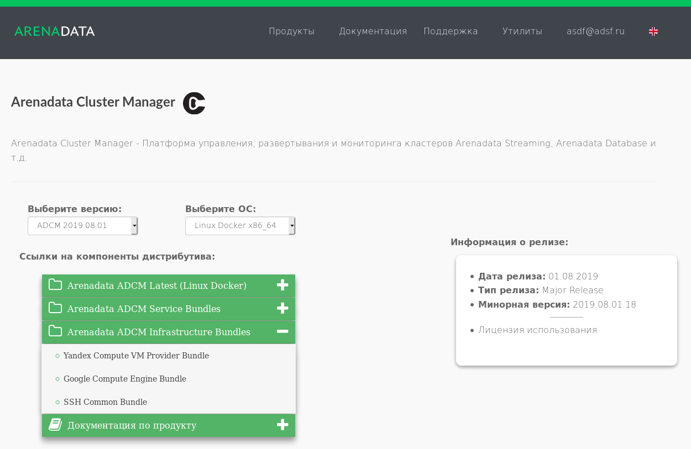

Загрузка бандла хостпровайдера ADCM
====================================

Для управления кластрером и его узлами через **ADCM** сначала необходимо подготовить хосты под кластер, а также связать эти хосты с **ADCM**. За эту функциональность отвечают хостпровайдеры **ADCM** -- плагины **ADCM**, которые инкапсулируют сложный механизм взаимодействия **ADCM** и подконтрольных ему хостов.

.. TODO примеры других бандлов

Дистрибутивы хостпровайдеров для **ADCM** выполнены в виде так называемых `бандлов <https://docs.arenadata.io/adcm/sdk/bundle.html>`_. В случае простейшего хост провайдера ssh -- это обычный архив, содержащий описание и программную логику подключения к хосту по протоколу ssh. Провайдер ssh в дальнейшем используется как пример.

Для загрузки бандла хостпровайдера необходимо перейти на сайт https://arenadata.tech/products/adcm и выбрать вкладку "Скачать". В результате чего отражается краткое описание продукта, ссылки на компоненты дистрибутива и информация о релизе (:numref:`Рис.%s.<adcm_hostprovider_download>`).

.. _adcm_hostprovider_download:

   Страница загрузки Arenadata Cluster Manager

После указания версии **ADCM** и операционной системы в раскрывающемся списке "Arenadata ADCM Infrastructure Bundles" предоставляется выбор вариантов загрузки бандлов хостпровайдеров -- по нажатию на элемент списка бразузер начинает загрузку. В блоке "Информация о релизе" отображается дата выхода, тип релиза выбранной версии и ссылки на лицензию.

Бандл хостпровайдера ssh называется *SSH Common Bundle*.
