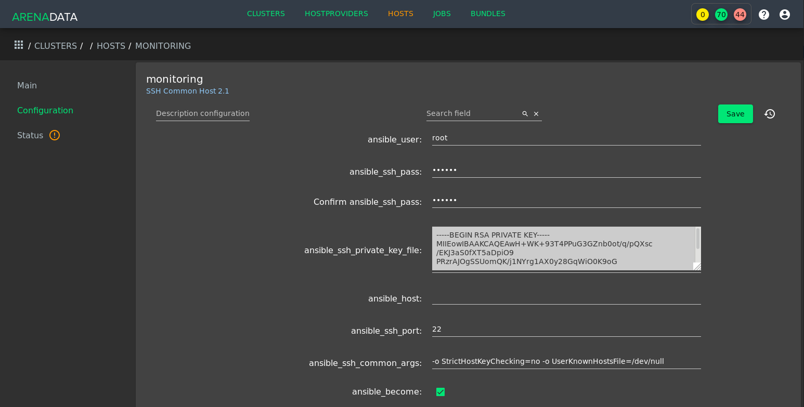

Добавление хостов в ADCM
========================

В случае использования не облачного хост провайдера, необходимо сначала инициализировать необходимые хосты -- хотя бы один. При этом обратите внимание на то, что некоторое компоненты кластера ADH могут потребовать более одного хоста для установки.

В простейшем случае при использовании хост провайдера ssh необходимо инициализировать хосты с возможностью подключения по протоколу ssh.

Далее необходимо создать эти хосты внутри ADCM:

   * Загрузить выбранный бандл хост провайдера как это описано в документации ADCM: https://docs.arenadata.io/adcm/user/quick.html;

   * На вкладке *"HOSTPROVIDERS"* добавить экземляр загруженного бандла, воспользовавшись кнопкой *"Create hostprovider"*;
     
   * На вкладке *"HOSTS"* добавить хосты, воспользовавшись кнопкой *"Create host"*.

Настройки для каждого добавленного в ADCM хоста возможно изменять. Для этого на вкладке *"HOSTS"* необходимо нажать на иконку шестерёнки в строке необходимого хоста. Так, в частности, при использовании хост провайдера ssh в настройках хоста возможно указать приватный ssh ключ в строке ansible_ssh_private_key_file:

   Страница настройки для хоста в ADCM на примере хост провайдера ssh
