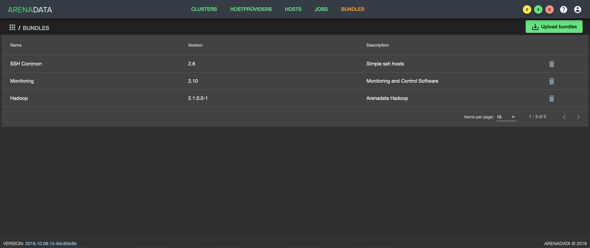

Выгрузка бандла хостпровайдера в ADCM
======================================

Для выгрузки бандла в **ADCM** следует выполнить следующие действия в веб-интерфейсе **ADCM**:

1. Открыть вкладку *"BUNDLES"* (:numref:`Рис.%s.<bundles>`).

.. _bundles:

.. figure:: ../imgs/install/bundles.png
   :align: center
   
   Вкладка "BUNDLES"

2. Нажать *"Upload bundle"* и в открывшейся форме выбрать файл бандла (:numref:`Рис.%s.<choose_bundle>`).

.. _choose_bundle:

.. figure:: ../imgs/install/choose_bundle.png
   :align: center
   
   Выбор файла бандла

3. В результате выполненных действий факт успешной выгрузки отображается в общем списке бандлов на вкладке *"BUNDLES"* (:numref:`Рис.%s.<load_bundle>`).

.. _load_bundle:

   
   Факт успешной выгрузки бандла
