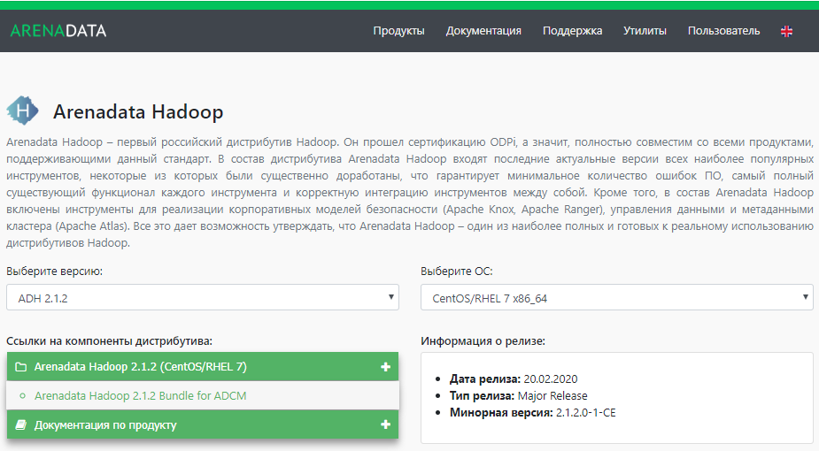

Загрузка бандла кластера
========================

.. TODO примеры других бандлов

Дистрибутивы кластеров для **ADCM** выполнены в виде `бандлов <https://docs.arenadata.io/adcm/sdk/bundle.html>`_. В случае кластера **ADH** -- это обычный архив, содержащий описание и программную логику развертывания и эксплуатации кластера.

Для загрузки бандла **ADH** необходимо перейти на сайте https://arenadata.io на вкладку *"Скачать"* продукта **Arenadata Hadoop**. При этом происходит переход на страницу `Магазин Программного Обеспечения Arenadata <https://store.arenadata.io/>`_ и открывается форма заявки для загрузки продукта (:numref:`Рис.%s.<download_form>`).

.. _download_form:

.. figure:: ../imgs/install/download_form.png
   :scale: 60 %
   :align: center

   Заявка для загрузки продукта

Все поля являются обязательными для заполнения. После отправки данных происходит переход на страницу *"Магазин Приложений"* с перечнем продуктов **Arenadata** (:numref:`Рис.%s.<install_download_app-store>`).

.. _install_download_app-store:

.. figure:: ../imgs/install/install_download_app-store.PNG
   :align: center

   Магазин Приложений

Для загрузки дистрибутива следует перейти на страницу продукта, кликнув на продукт **Arenadata Hadoop**. При этом происходит переход на соответствующую страницу с кратким описанием, ссылками на компоненты дистрибутива и информацией о релизе (:numref:`Рис.%s.<download>`).

.. _download:

   Страница загрузки Arenadata Hadoop

После указания версии **ADH** и операционной системы в раскрывающемся списке *"Ссылки на компоненты дистрибутива"* предоставляется выбор вариантов загрузки дистрибутива -- по нажатию на элемент списка бразузер начинает загрузку. В блоке *"Информация о релизе"* отображается дата выхода, тип релиза выбранной версии, ссылки на лицензию и Release Notes.
