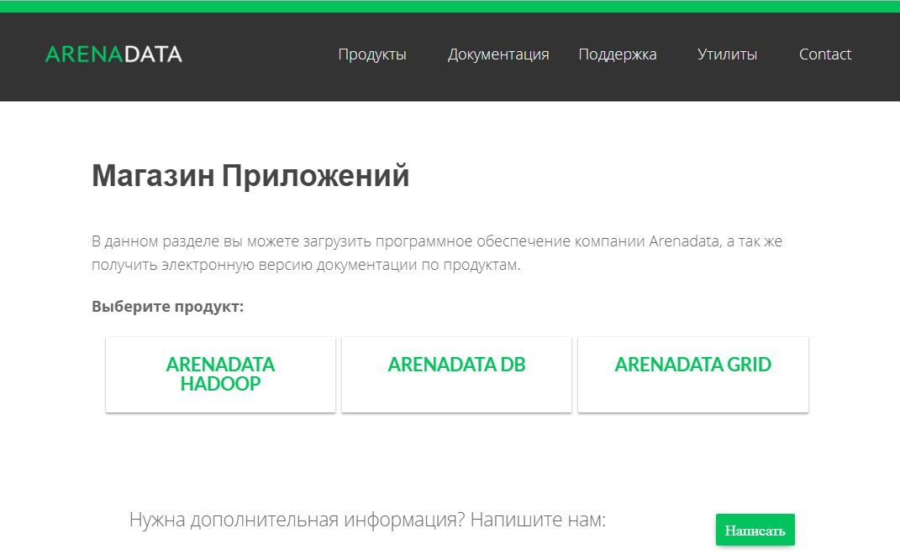
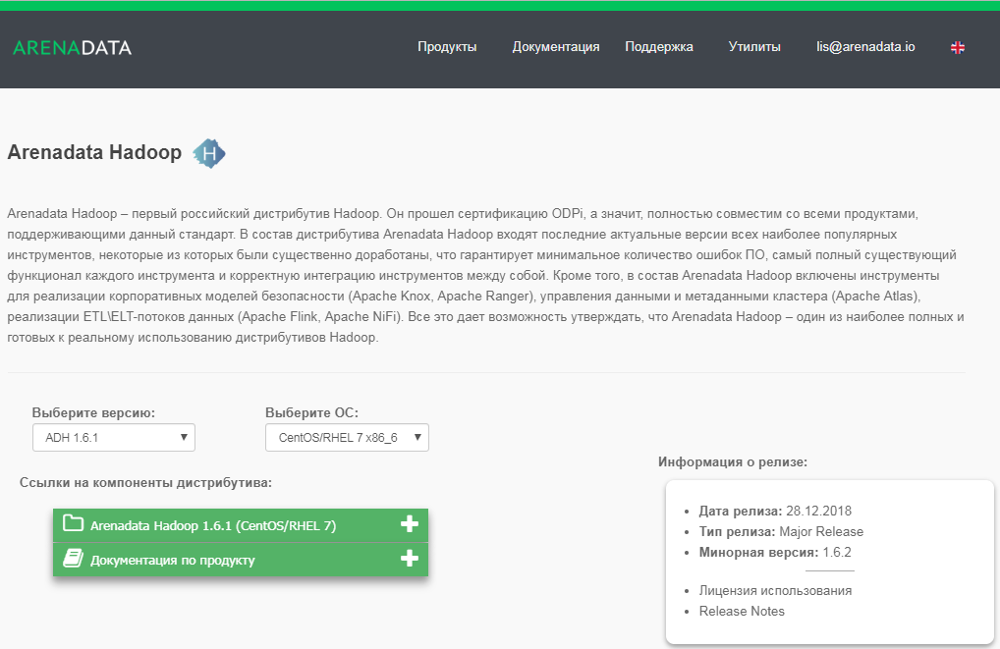

Загрузка дистрибутива кластера
==============================

Для загрузки дистрибутива кластера **Arenadata Hadoop** необходимо на сайте `arenadata.io <https://arenadata.tech/>`_ выбрать вкладку *"Скачать"*. При этом происходит переход на страницу *Магазин Программного Обеспечения Arenadata* (`store.arenadata.io <https://store.arenadata.io/>`_, :numref:`Рис.%s.<install_download_app-store>`), и открывается экранная форма заявки для загрузки продукта (:numref:`Рис.%s.<install_download_form-download>`).

.. _install_download_form-download:

.. figure:: ../imgs/install_download_form-download.png
   :scale: 60 %
   :align: center

   Заявка для загрузки продукта

В экранной форме заявки следует заполнить следующие поля:

+ *ФИО* – ФИО пользователя;
+ *E-Mail* – адрес электронной почты пользователя;
+ *Компания* – наименование компании пользователя;
+ *Цель использования* – описание цели использования кластера.

Все поля являются обязательными для заполнения. После ввода данных необходимо нажать кнопку *Отправить*, в результате чего выдается соответствующее сообщение (:numref:`Рис.%s.<install_download_accepted>`).

.. _install_download_accepted:

.. figure:: ../imgs/install_download_accepted.png
   :scale: 80 %
   :align: center

   Заявка принята

При закрытии окна происходит переход на страницу *Магазин Приложений* с перечнем продуктов **Arenadata** (:numref:`Рис.%s.<install_download_app-store>`).

.. _install_download_app-store:

   Магазин Приложений

При наведении курсора на продукт **ARENADATA HADOOP** предоставляется выбор действий:

+ *Скачать* -- переход на страницу загрузки дистрибутива кластера **ADH**;
+ *Документация* -- переход на страницу он-лайн документации кластера **ADH**.

Для загрузки дистрибутива кластера следует выбрать пункт *Скачать*, при этом происходит переход на соответствующую страницу с кратким описанием продукта, ссылками на компоненты дистрибутива и информацией о релизе (:numref:`Рис.%s.<install_download_download-ADH1.6.1>`).

.. _install_download_download-ADH1.6.1:

   Страница загрузки кластера Arenadata Hadoop

В разделе *"Выберите версию продукта"* следует указать интересующую версию кластера **ADH**, а в поле *"Выберите ОС"* -- используемую операционную систему. При этом в разделе *"Информация о релизе"* отображается дата выхода и тип релиза выбранной версии, ее номер, ссылки на лицензию использования и Release Notes.

В разделе *Ссылки на компоненты дистрибутива* находятся ссылки для загрузки компонентов выбранной версии кластера. После загрузки компонентов следует установить их, действуя в соответствии с последующими разделами настоящего документа.

Так же в Магазине Приложений на вкладке *Утилиты* есть ссылка *Калькулятор Hadoop* -- страница калькулятора для расчета необходимого количества серверов заданной конфигурации для хранения и обработки указанного объема пользовательских данных в **HDFS** (:numref:`Рис.%s.<install_download_calc-ADH1.5>`).

.. _install_download_calc-ADH1.5:

.. figure:: ../imgs/install_download_calc-ADH1.5.png
   :align: center

   Калькулятор оборудования для Hadoop

На странице калькулятора можно задать персональные параметры в соответствующих полях для расчета необходимого количества серверов заданной конфигурации для хранения и обработки указанного объема пользовательских данных в **HDFS**.

