Установка ADH в ADCM
====================

Выгрузка бандла ADH в ADCM
^^^^^^^^^^^^^^^^^^^^^^^^^^

Выгрузка бандла ADH необходима для создания в ADCM прототипа кластера, из которого в дальнейшем возможно создание его экземпляров.

Для выгрузки бандла следует выполнить действия аналогичные :doc:`выгрузке бандла хостпровайдера <adcm_upload>`.

Создание экземпляра кластера
^^^^^^^^^^^^^^^^^^^^^^^^^^^^

При создании кластера в веб-интерфейсе ADCM генерируется новый экземпляр кластера ADH, что означает только добавление данных о нем в базу данных ADCM -- на этом этапе не производится установка ADH на хосты.

1. Открыть в ADCM вкладку *"CLUSTERS"*:

.. figure:: ../imgs/install/cluster_mon.png
   :align: center

   Вкладка *"CLUSTERS"*

2. Нажать *"Add cluster"* и в открывшейся форме создать экземпляр кластера из прототипа ADH:

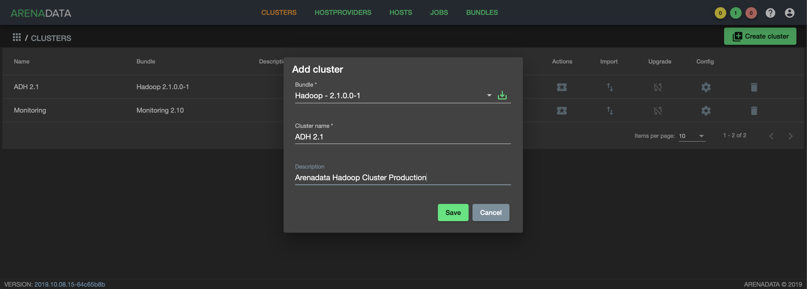

   Создание экземпляра кластера

3. В результате экземпляр кластера отразится в списке на вкладке *"CLUSTERS"*:

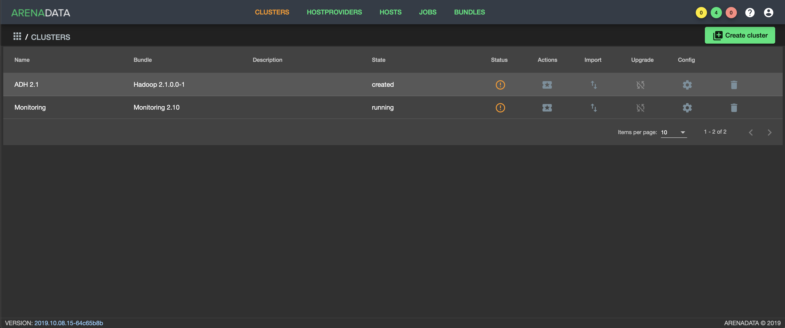

   Результат успешного создания экземпляра кластера

Добавление сервисов кластера
^^^^^^^^^^^^^^^^^^^^^^^^^^^^

.. important:: На текущий момент невозможно удалить из кластера уже добавленный сервис

Для добавления сервисов в кластер ADH необходимо:

1. в меню кластера ADH открыть вкладку *"Services"*;

2. нажать *"Add service"*;

3.в открывшейся форме выбрать необходимые сервисы;

4. нажать *"Save"*.

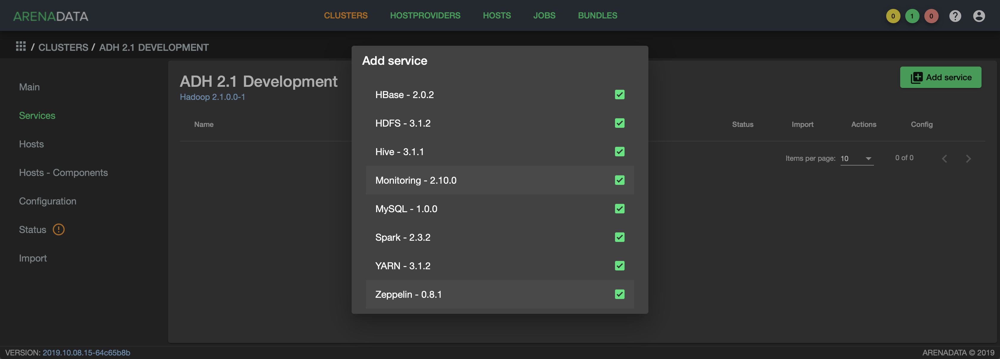

   Выбор сервисов

Возможность добавления нового сервиса в уже работающий кластер не отличается от установки сервиса с нуля.

Конфигурирование сервиса
^^^^^^^^^^^^^^^^^^^^^^^^

Для перехода к настройкам сервиса кластера необходимо нажать кнопку с пиктограммой шестеренки в соответствующей строке вкладки пункта меню *"Services"*.

.. figure:: ../imgs/install/service_configure.png
   :align: center

   Настройка сервиса

По завершении конфигурирования сервиса нажмите *"Save"*.

В случае, если сервису требуется изначальная настройка, то в поле *"Actions"* соответствующего сервиса вместо иконки будет отражён оранжевый восклицательный знак:

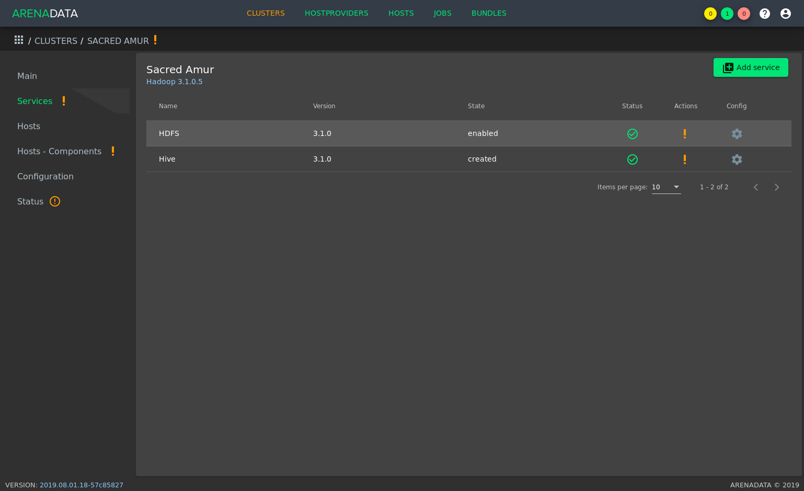

   Сервисы, требующие настройки

Это означает, что необходимо открыть страницу конфигурирования сервиса и заполнить поля, выделенные оранжевым:

.. figure:: ../imgs/install/service_configure_warning_in.png
   :align: center

   Настройка сервиса, требующего настройки

.. _add_hosts:

Добавление хостов
^^^^^^^^^^^^^^^^^

Для добавления хостов в кластер ADH необходимо:

1. В меню кластера ADH открыть вкладку *"Hosts"*:

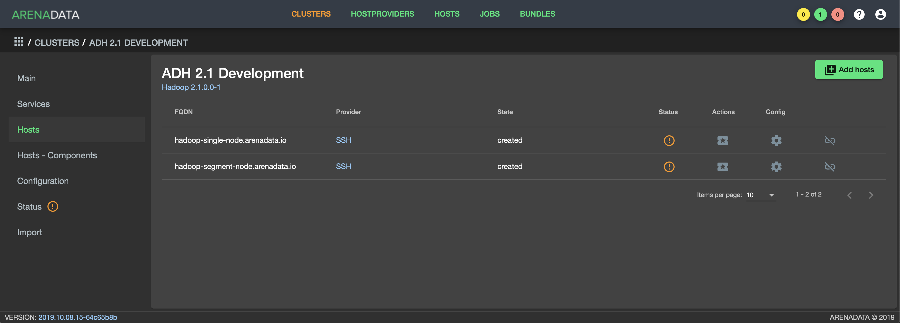

   Вкладка *"Hosts"* кластера ADH

2. Нажать *"Add hosts"* и в открывшейся форме выбрать необходимые хосты:

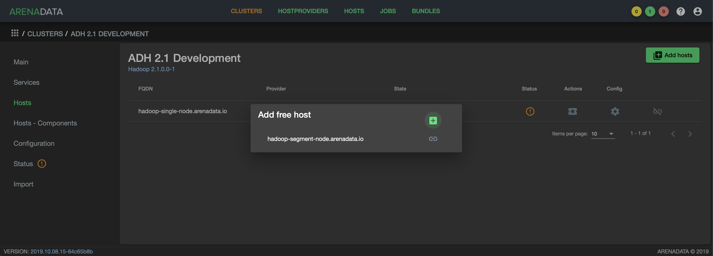

   Выбор хостов

3. В результате добавленные хосты отразятся в списке вкладки *"Hosts"*:

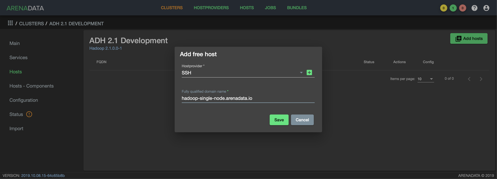

   Результат успешного добавления хостов

.. _install_components:

Размещение компонентов сервисов на хостах
^^^^^^^^^^^^^^^^^^^^^^^^^^^^^^^^^^^^^^^^^

Изначально ни на одном из хостов нет компонентов -- распределение компонентов происходит вручную.

Для размещения компонентов необходимо перейти на вкладку *"Hosts - Components"*:

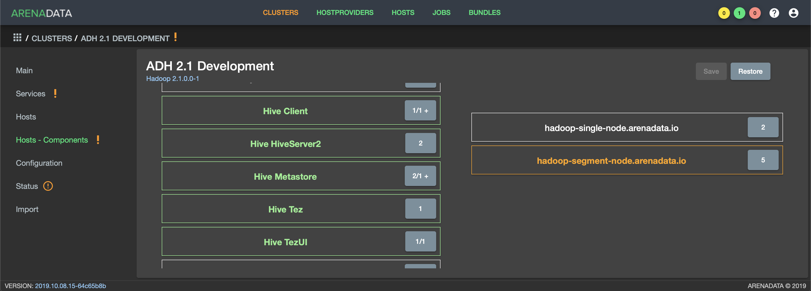

   Размещение компонентов сервисов на хостах

И распределить компоненты одним из двух способов:

1. выбрать компонент в колонке "Components" и определить для него хост в колонке "Hosts";
2. выбрать хост в колонке "Hosts" и определить для него компонент в колонке "Components".

.. important:: В сервисе могут быть обязательные и необязательные компоненты. Если компонент обязательный, то в его количественном счётчике справа от названия присутствует символ '/'. Без назначения хоста обязательному компоненту карту размещения сервисов нельзя сохранить.

По завершении распределения хостов нажмите *"Save"*.

Конфигурирование кластера
^^^^^^^^^^^^^^^^^^^^^^^^^

Для перехода к настройкам экземпляра кластера ADH необходимо нажать кнопку с пиктограммой шестеренки в соответствующей строке вкладки *"CLUSTERS"* и перейти в раздел меню *"Configuration"*. При этом открывается окно конфигурации выбранного экземпляра:

.. figure:: ../imgs/install/cluster_config.png
   :align: center

   Окно конфигурирования кластера

По завершении конфигурирования кластера нажмите *"Save"*.

.. _install_services:

Установка сервисов кластера
^^^^^^^^^^^^^^^^^^^^^^^^^^^

.. important:: Порядок установки сервисов и зависимости между ними на данный момент не ограничивается со стороны ADCM.

Устанавливать сервисы необходимо в следюущем порядке:

1. Zookeeper

2. HDFS

3. YARN

4. HBase

5. Hive

6. Spark

7. Monitoring

Для установки добавленного сервиса необходимо в строке нужного сервиса нажать на пиктограмму в поле *"Actions"* и выбрать действие *Install*. После этого ADCM запустит задачу установки. Более конкретно о статусе и информации о задачах возможно узнать на вкладке *"JOBS"*:

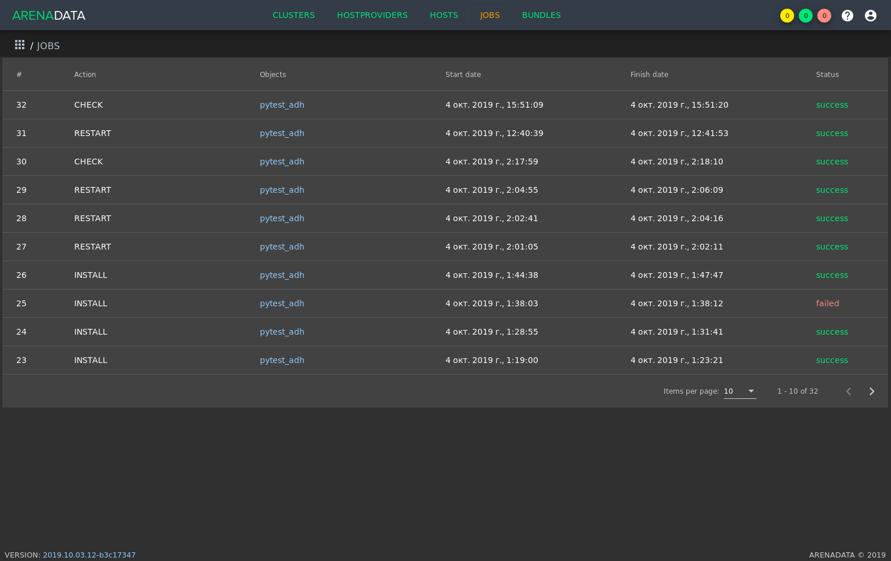

   Вкладка *"JOBS"*

.. important:: Статус задач ADCM отражается в правом верхнем углу web-интерфейса. Жёлтый круг отражает количество запущенных задач, а зелёный и красный -- количество успешно и неуспешно завершённых задач соответственно.

Успешное завершение установки сервиса определяется переходом задачи из статуса "running" в статус "success" на вкладке *"JOBS"*. При неудачном завершении задача переходит в статус "failed". При таком исходе возможно нажать на строку задачи на странице вкладки *"JOBS"* для получение более подробной информации о возникших ошибках:

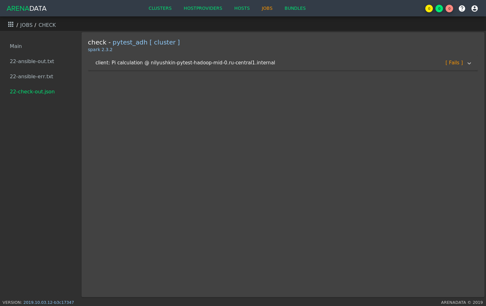

   Страница конкретной задачи

На странице задачи в левой части экрана обязательно содержаться 2 раздела: *"№-ansible-out.txt"* и *"№-ansible-out.txt"*, где № является номером задачи. Это технические логи задачи, которые могут помочь в определении причины проблем.

Также может существовать опциональный третий раздел *"№-check-out.json"* -- это логи проверок частых ошибок, описание этих ошибок более простое и конкретное, чем в случае первых двух технических логов.

Содержимое всех трёх разделов подлежит изучению при возникновении ошибок.

После установки сервис запустится автоматически, кроме сервиса Zookeeper -- его требуется запустить вручную нажатием на кнопку *"Start"*.

.. important:: Сервис Zookeeper требует ручного запуска.

По результатам инсталляции сервис изменяет состояние (поле *"State"*) с *created* на *installed*.

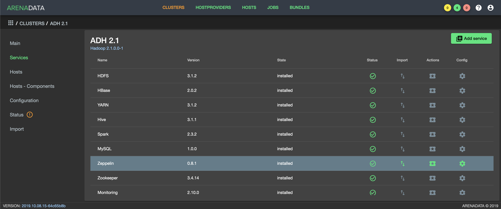

   Состояние сервисов кластера

Особенности установки сервисов
------------------------------

Hive
++++

Компонент Metastore сервиса Hive требует наличие БД MySQL/MariaDB и доступов к ней.

Сервис MySQL/MariaDB в бандл ADH не входит, его необходимо устанавливать и настраивать другими средствами.

.. important:: Помимо настройки самого сервиса MySQL/MariaDB для использования его сервисом Hive необходимо также настроить соответствующие доступы (GRANT).

Так, самый простой случай выдачи доступов выглядит следующим образом:

.. code-block:: shell

   MariaDB [(none)]> GRANT ALL ON *.* TO 'root'@'<metastore_fqdn>' identified by '<password>' WITH GRANT OPTION;

Где <metastore_fqdn> и <password> необходимо заменить реальными данными конкретного сервера MySQL/MariaDB.

Указать сервису Hive адрес и учётные данные для подключения к БД возможно в `настройках сервиса <Конфигурирование сервиса_>`_.

Monitoring
++++++++++

Сервис Monitoring кластера ADH требует `установки отдельного кластера Monitoring <https://docs.arenadata.io/mon/ru/index.html>`_ для целей интеграции в него кластера ADH.

После установки кластера Monitoring его необходимо интегрировать в кластера ADH. Для этого необходимо перейти в раздел меню *"Import"* кластера ADH:

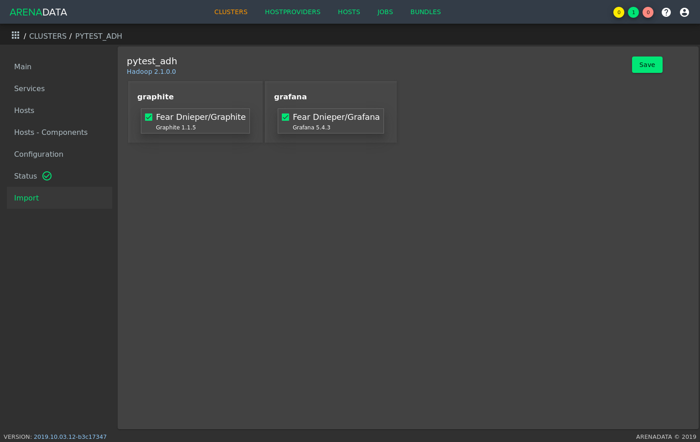

   Раздел меню "Import"

Далее необходимо отметить флагами оба импортируемых сервиса кластера Monitoring: Graphite и Grafana, и нажать "Save" в верхней правой части страницы.

После интеграции сервису Monitoring кластера ADH становятся доступными средства для мониторинга некоторых сервисов кластера ADH:

- HDFS

- YARN

- HBase

- Spark

Для использования этих средств необходимо установить сервис, предназначенный для мониторинга, и сервис Monitoring кластера ADH.

.. important:: В случае, если сервис Monitring установлен после сервиса, предназначенного для мониторинга, необходим рестарт этого сервиса.
